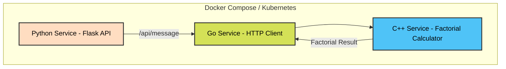

# Simple Docker compose project

This is a simple project to test the capabilities of Docker compose. It consists of a Python service, a Go service, and a C++ service. All of them are designed to be run inside Docker containers.

## How to run the project
1. Run docker compose
```docker
docker compose up
```

2. Check the output of the services
```docker
docker compose logs -f
```

3. Stop the services
```docker
docker compose down
```

4. Clean up the project
```docker
docker system prune -a
```

<hr/>

## Visual explanation



