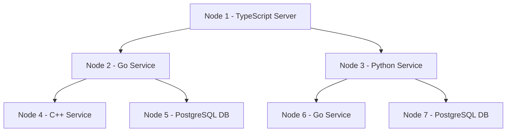

  

# Docker Binary Tree Project

  

This project demonstrates how to create a distributed system using Docker containers, where each container represents a service or database node in a binary tree structure. The nodes in the tree are implemented in different programming languages like TypeScript, Go, Python, and C++. The tree structure allows the services to interact with each other, with each parent node depending on its child nodes to perform some task.

  

## Overview of the Project

  

## What Is a Binary Tree?

  

In this project, we are using a binary tree, a data structure where each “parent” node has at most two “child” nodes. This structure is common in computing and makes it easy to distribute tasks between nodes.

  

## What Does Each Node Do?

  

Each “node” in this project is a Docker container running a specific service or a database:

  

• **Node 1:** A TypeScript service acting as the root node. It sends tasks to both Node 2 and Node 3.

• **Node 2**: A Go service that handles tasks passed down from Node 1 and interacts with a PostgreSQL database (Node 5).

• **Node 3**: A Python service that handles tasks passed down from Node 1 and interacts with a PostgreSQL database (Node 7).

• **Node 4:** A C++ service, which performs a calculation (like factorial) for Node 2.

• Node 5: A PostgreSQL database used by Node 2 to store and retrieve data.

• Node 6: Another Go service, which helps Node 3 process tasks.

• Node 7: A PostgreSQL database used by Node 3.

  

Mermaid Diagram

  

Here’s a visual representation of the project in a binary tree structure:

  


## How the Project Works

  

1. Node 1 (TypeScript):

• This node is the root of the binary tree. It receives incoming requests and delegates them to Node 2 (Go) and Node 3 (Python).

• It acts as the “brain” of the system, coordinating tasks and sending them down the tree.

2. Node 2 (Go):

• This node receives tasks from Node 1 and performs some logic. It may request data from its child nodes, which include Node 4 (C++) for calculations and Node 5 (PostgreSQL) for data storage.

3. Node 3 (Python):

• Like Node 2, this node receives tasks from Node 1 but works independently to process tasks. It also depends on Node 6 (Go) and Node 7 (PostgreSQL) to complete its tasks.

4. Node 4 (C++):

• This node performs some computational tasks like calculating factorials, which Node 2 requests.

5. Node 5 (PostgreSQL Database):

• This node stores data that is needed by Node 2 (Go) for some of its operations. It’s a standard database container running PostgreSQL.

6. Node 6 (Go):

• This is another Go service, which assists Node 3 (Python) with specific tasks.

7. Node 7 (PostgreSQL Database):

• This node is another PostgreSQL database that stores and manages data for Node 3 (Python).

  

How to Run the Project

  

Prerequisites

  

• Docker: Make sure you have Docker installed on your machine.

• Docker Compose: You need Docker Compose to orchestrate the containers.

  

Steps to Run the Project

  

1. Clone the Project:

  
  

```bash
cd docker-binary-tree
```

  
  

2. Run the Docker Containers:

  

```
docker-compose up --build
```
  
  

3. Access the Services:

• You can access Node 1 (TypeScript Server) by navigating to http://localhost:3000 in your browser. This will send requests to Node 2 (Go Service) and Node 3 (Python Service), which will in turn query their respective child nodes.

  

## Directory Structure

  

docker-binary-tree/
```bash

│

├── node1/ # TypeScript service (Node 1)

│ ├── Dockerfile

│ ├── package.json

│ └── server.ts

│

├── node2/ # Go service (Node 2)

│ ├── Dockerfile

│ └── main.go

│

├── node3/ # Python service (Node 3)

│ ├── Dockerfile

│ ├── app.py

│ └── requirements.txt

│

├── node4/ # C++ service (Node 4)

│ ├── Dockerfile

│ └── main.cpp

│

├── node5/ # PostgreSQL database for Node 2 (Node 5)

│ ├── Dockerfile

│ └── init-db.sql

│

├── node6/ # Go service (Node 6)

│ ├── Dockerfile

│ └── main.go

│

├── node7/ # PostgreSQL database for Node 3 (Node 7)

│ ├── Dockerfile

│ └── init-db.sql

│

└── docker-compose.yml # Docker Compose file to orchestrate all containers

  
```

## Technologies Used

  

• **TypeScript**: Node 1 is a TypeScript service that acts as the entry point to the system.

• **Go**: Node 2 and Node 6 are written in Go to handle backend tasks.

• **Python**: Node 3 is a Python service handling requests passed from Node 1.

• **C++**: Node 4 is a C++ service performing a computation (factorial in this case).

• **PostgreSQL**: Node 5 and Node 7 are PostgreSQL databases for storing and retrieving data.

  

## Conclusion

  

This project showcases how to structure a binary tree of interconnected services using Docker. Each node is implemented in a different language and relies on its child nodes to process tasks or retrieve data. Docker Compose allows these services to run together, making it easy to see how distributed systems can be structured in a binary tree.